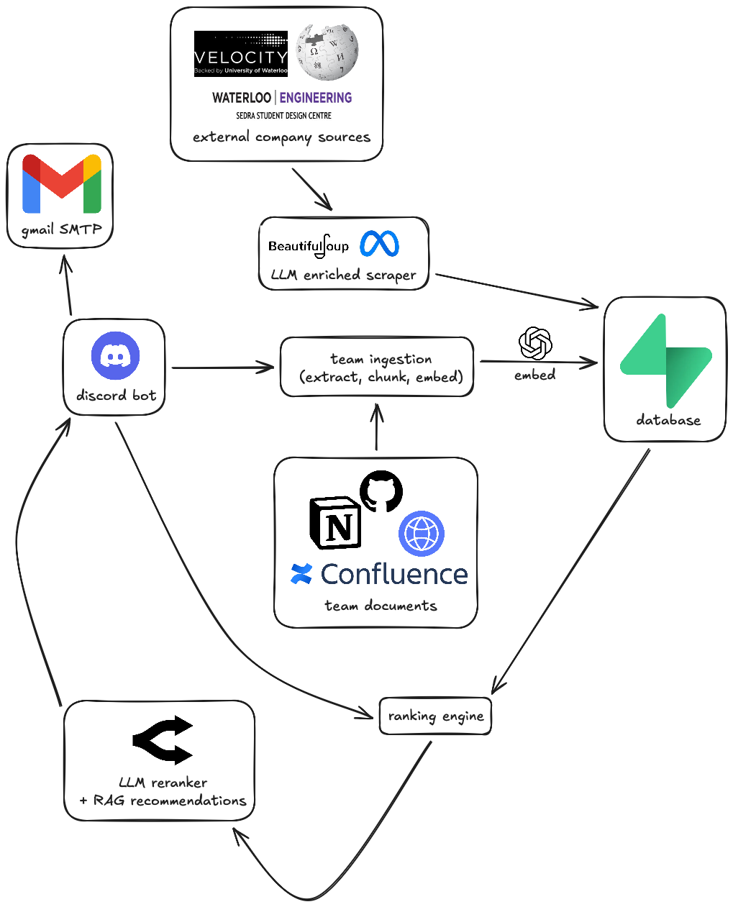

<div align="center">


# Prospector

Perplexity for design team sponsors — reads your docs, ranks 1,600+ companies by fit, and drafts the outreach.

</div>

---

## Overview

Waterloo design teams build satellites, solar cars, and autonomous vehicles — projects that rival professional engineering efforts. But finding sponsors to fund them still means team leads manually cold emailing hundreds of companies, on top of a full course load, hoping someone replies.

Prospector fixes that. Point it at your GitHub, Notion, or Confluence and it builds a picture of what your team needs. Ask it for sponsors — it searches 1,600+ companies ranked by technical fit and Waterloo affinity, explains every match, and writes the cold email.

### Demo

https://github.com/user-attachments/assets/c71ee95b-9114-423a-8f52-e9d12d530846

## Features

- **Sponsor discovery** — semantic search over 1,600+ companies, re-ranked by an LLM for your specific query
- **Waterloo-aware** — companies that already sponsor design teams rank higher
- **Contact finding** — scrapes company sites for real emails, falls back to MX-validated suggestions
- **Match explanations** — specific reasons why each company fits, not generic filler
- **Outreach drafting** — generates and sends cold emails via Gmail
- **Team context ingestion** — GitHub, Notion, Confluence, any URL
- **RAG chat** — ask anything about your team or the sponsor database

## How to use

### From Zero to Running

#### 1. Install dependencies

```bash
pip install -r requirements.txt
```

#### 2. Create a Discord bot

1. Go to [discord.com/developers/applications](https://discord.com/developers/applications) → **New Application**
2. **Bot** tab → **Add Bot** → **Reset Token** → copy it (this is `DISCORD_TOKEN`)
3. Scroll down → enable **Message Content Intent**
4. **OAuth2 → URL Generator** → scopes: `bot`, `applications.commands` → permissions: `Send Messages`, `Read Messages`, `Use Slash Commands`
5. Copy the generated URL → open it in browser → add bot to your server
6. Right-click your server name → **Copy Server ID** (this is `GUILD_ID`)

#### 3. Get your other API keys

| Key                                 | Where to get it                                                 |
| ----------------------------------- | --------------------------------------------------------------- |
| `OPENROUTER_API_KEY`                | [openrouter.ai/keys](https://openrouter.ai/keys)                |
| `SUPABASE_URL` + `SUPABASE_KEY`     | Your Supabase project → Settings → API                          |
| `GITHUB_TOKEN`                      | GitHub → Settings → Developer Settings → Personal Access Tokens |
| `GEMINI_API_KEY`                    | [aistudio.google.com](https://aistudio.google.com)              |
| `GMAIL_USER` + `GMAIL_APP_PASSWORD` | Gmail → Google Account → Security → App Passwords               |

#### 4. Configure environment

```bash
cp .env.example .env
# fill in all keys above
```

#### 5. Populate the database

Run once, re-run to update.

```bash
python scraper/run.py
```

Sources: Waterloo design team sponsor pages, Velocity incubator, Wikipedia engineering categories, curated seeds.

Output: ~1,600 entities with summaries, tags, and Waterloo affinity evidence stored in Supabase.

#### 6. Run the bot

```bash
bash scripts/run_bot.sh
```

You'll see `[on_ready] ready` when it's up. Slash commands sync automatically on startup (~5s).

### Discord Commands

#### First time (in order)

```
/setup-team       Register your team — point it at your GitHub org URL
/configure-team   Join the team (every member runs this)
/analyze-team     Load your team context — see blockers, stack, recruiting gaps
```

#### Finding sponsors

```
/find-sponsors    Search ranked sponsor candidates ("we need RF hardware support")
/explain-match    Drill into why a specific company was recommended
/recruit-gap      See what roles your team is missing
```

#### Context and memory

```
/add-context           Add a Notion page, Confluence space, or URL to your team's knowledge
/remove_from_memory    Delete specific chunks by search query
/nuke                  Wipe all data for your team
```

#### Email outreach

```
/chat           RAG chat — ask anything about your team or sponsors
/sample_email   Draft a cold email to a matched company
/send_email     Send the draft via Gmail
```

### Dev Tools

Testing the RAG pipeline without opening Discord:

```bash
python test_rag.py "we need RF hardware support"
```

## Stack

- **Bot**: discord.py
- **Backend**: FastAPI
- **Database**: Supabase (pgvector)
- **Scrapers**: httpx, trafilatura, BeautifulSoup4

## Architecture


